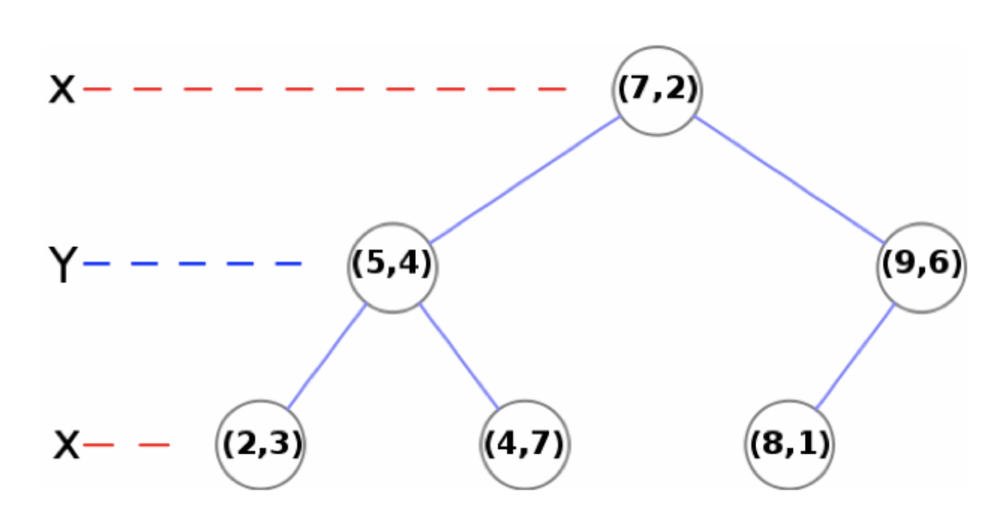
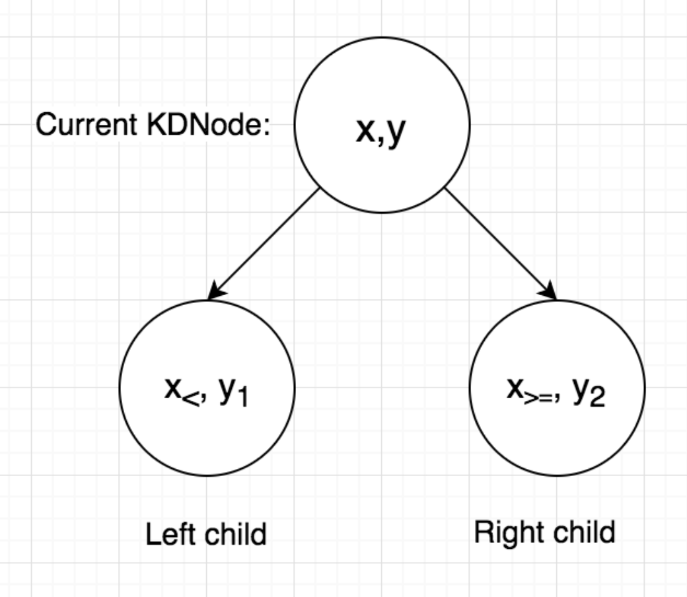
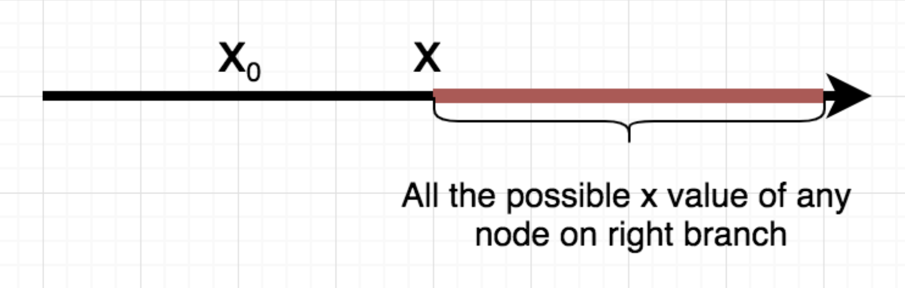
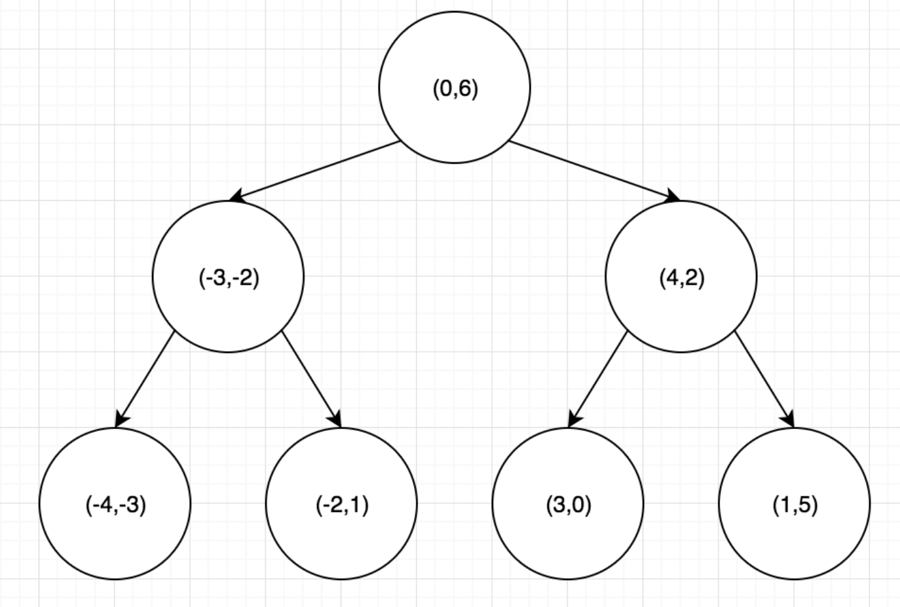
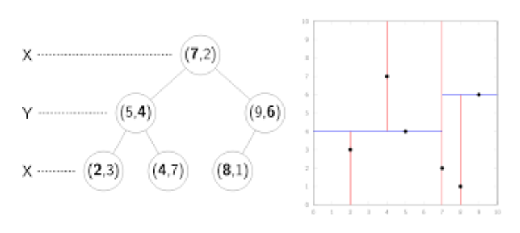

# PA1: BST and KDT in C++

## Due: by 11:59pm on Tuesday 8/13/2019

## Table of Contents
- [PA1: BST and KDT in C++](#PA1-BST-and-KDT-in-C)
  - [Overview](#Overview)
  - [Pair Programming Partner Instructions](#Pair-Programming-Partner-Instructions)
  - [Academic Integrity and Honest Implementations](#Academic-Integrity-and-Honest-Implementations)
  - [Retrieving Starter Code](#Retrieving-Starter-Code)
  - [Part 1: Binary Search Tree in C++](#Part-1-Binary-Search-Tree-in-C)
    - [1. Examine and understand the code](#1-Examine-and-understand-the-code)
    - [2. Implement methods in BSTNode.hpp, BSTIterator.hpp, and BST.hpp](#2-Implement-methods-in-BSTNodehpp-BSTIteratorhpp-and-BSThpp)
    - [3. Check for memory leaks](#3-Check-for-memory-leaks)
  - [Part 2: KD Trees in C++](#Part-2-KD-Trees-in-C)
    - [1. Point Class](#1-Point-Class)
    - [2. Example: Building a KD Tree on 2-dimensional data](#2-Example-Building-a-KD-Tree-on-2-dimensional-data)
      - [3. Implement methods in KDT.hpp](#3-Implement-methods-in-KDThpp)
    - [4. Test your KD tree](#4-Test-your-KD-tree)
      - [Small Test Case 1](#Small-Test-Case-1)
      - [Small Test Case 2](#Small-Test-Case-2)
      - [Large Test Cases](#Large-Test-Cases)
  - [Testing your code and getting help](#Testing-your-code-and-getting-help)
  - [Getting Help](#Getting-Help)
  - [Submission Instructions](#Submission-Instructions)
    - [Submitting Your PA](#Submitting-Your-PA)
    - [Grading](#Grading)

## Overview
* In this project, you will be asked to complete two major tasks. The first is to implement some number of BST methods. This part is essentially a warmup on C++ programming in the STL. The second part is to implement a two-dimensional K-D Tree and implement nearest neighbor point search. **Your first step is to _read these instructions carefully_** before you start writing code or post questions on piazza.
* This is a Pair Programming project. You may ask Professors/TAs/Tutors for some guidance and help, but you can not copy code from anywhere including online sources such as Github. You may also discuss the assignment conceptually with your classmates, including bugs that you ran into and how you fixed them. However, do not look at or copy code, as this constitutes an Academic Integrity Violation. And you may not use other libraries’ implementations in your solutions.
* For this assignment and the remainder of the course, you are expected to use Git to keep track of your code and Github to store your code. Make a **private** repository (free on Github now) on Github, commit and push your code regularly as you go through the assignment.

**_Start early, and submit early and often!_**


## Pair Programming Partner Instructions
If you wish to work with a partner, please be sure to read the guidelines for Pair Programming in the syllabus carefully. Make sure to have both of the partners’ names on the headers of all files. Most importantly, **make sure to submit your homework on Gradescope using only ONE of the accounts and do not forget to add the other teammate's account into the submission.**


## Academic Integrity and Honest Implementations
We will hand inspect all submissions and will use automated tools to look for plagiarism or deception. **Attempting to solve a problem by other than your own means will be treated as an Academic Integrity Violation.** This includes all the issues discussed in the Academic Integrity Agreement, but in addition, it covers deceptive implementations. For example, if you use a library (create a library object and just reroute calls through that library object) rather than writing your own code, that’s seriously not okay and will be treated as dishonest work.


## Retrieving Starter Code

## Part 1: Binary Search Tree in C++
In this part of the assignment, you will implement the fundamental BST operations using concepts from the C++ Standard Template Library, which includes writing an iterator for it. **Your BST does not need to handle duplicates.** You will then use your BST implementation in a speed comparison.

### 1. Examine and understand the code
Your first task is to understand the code. Do not attempt to start writing code until you have a firm grasp of what the provided code does and what you are supposed to do with it. **Nearly all the required functionality is specified in the code and the comments, so you'll need to read everything carefully.** Make sure you can understand the provided test file `test_BST.cpp`, which partially tests some aspects of the BST class. Then you should add your own tests before you start implementing any code of your own, although we won’t be grading your testers.

### 2. Implement methods in BSTNode.hpp, BSTIterator.hpp, and BST.hpp

In **BSTNode.hpp**:
* **constructor**: `BSTNode(const Data & d)`
* **successor method** (this method is used in the BSTIterator's ++ operators to advance the iterator): `BSTNode<Data>* successor()`

In **BSTIterator.hpp**:
* **==method**:
```C++
bool operator==(BSTIterator<Data> const& other) const 
```
* **!= method**:
```C++
bool operator!=(BSTIterator<Data> const& other) const
```

In **BST.hpp**:
* **insert method**: `virtual bool insert (const Data& item)`
* **find method**: `virtual iterator find (const Data& item) const`
* **size method**: `unsigned int size() const`
* **height method**: `unsigned int height() const`
* **empty method**: `bool empty() const`
* **inorder method** (this method might be useful for debugging):
```C++
void inorder(BSTNode<Data> *n) const
```
* **first method**: `static BSTNode<Data> * first(BSTNode<Data> * root)`
* **deleteAll method**: `static void deleteAll (BSTNode<Data>* n)`
* **destructor**: `virtual ~BST()`


Implementation notes for BST:

1. When you implement these functions, any comparisons you make between two elements **must be done using the < operator**. The reason for this is that some data types in this project do not have the other operators (>, <=, >=, etc.) implemented, so for safety reasons, it's best to only use < to compare. Remember: given an element, you need to check if it's less than, greater than, or equal to elements currently in the BST. How can you do that with just the < operator?
2. Try to analyze different cases of successor() by examining the successor of all the nodes in a BST that you draw.
3. The first node is a BST is the one with the lowest value. A node's successor is the node with the next highest value. This means that iterating from the first node to each successor should list all nodes in ascending sorted order.

### 3. Check for memory leaks

The Makefile is provided for your convenience. Running make in the directory will compile your code and create the executable files. You should read and understand it as you will be required to submit your own Makefile in later assignments (but not this one). Your code should compile with the given Makefile as this is how we will compile and run your submission when grading. 

To check memory leaks, run valgrind on the BST tester:
```
> valgrind ./test_bst 
```

(there are lots of options you can use, but this is enough for now) 

* Notice under LEAK SUMMARY: If it reports that some memory was "definitely lost" then it means you have a memory leak. Check your deleteAll method and see if all the memories allocated are destructed or not!
* For details of what all the LEAK SUMMARY lines mean, see: http://valgrind.org/docs/manual/faq.html#faq.deflost

We have provided a more detailed guideline of testing in the second last part, make sure you read that carefully to guide your testing.

Note that the provided BST tester might not test your BST comprehensively, so you need to read the tester, understand what it does and come up with your own test cases.

## Part 2: KD Trees in C++

Binary search trees are useful data structures and their fundamental structure is used in other data structures as well. As such, they have been modified and adapted to help solve a variety of real-world problems. In this part, we will introduce a new data structure to efficiently search closest points of a given point in higher dimension.

KD Trees (short for k-dimensional trees) are used widely to find a point or set of points in the current KD tree that are closest to another arbitrary point. They can also help you find all points within a particular region (but we won’t implement that here). They have plenty of applications such as accelerating ray tracing in computer graphics, searching points on 2-D maps and accelerating machine learning algorithms like clustering and KNN.

The KD Tree that we will be implementing will be 2-dimensions, and output **_one_** closest point in current KD tree to a given point. After you finish implementing KD tree, you will then apply it to help you search for closet point for a given point. Then you will perform some simple experiments on the runtime of your KD tree.

### 1. Point Class

Same as part 1, you will need to read the Point class in KDT.hpp file and find **“TODO”** statements to understand what you are required to implement. Please do not change the rest of the code.

Before you start implementing the KD tree, you first need to understand the provided Point class to know how to use it later to represent any given data. 

We have provided method headers in the starter code. Make sure you read them carefully to understand what each method does. Then you can refer to the following for additional details and clarifications.

1. A Point class is defined by its _x_ and _y_ coordinates, which represents a 2-D point. 

2. Notice that Point class has a function named `squareDistance`, it should return the square of Euclidean distance between Points p1 and p2. In KD tree we usually compute the Euclidean distance to determine which point is closer, but we will instead use square of it here to speed up the computation. Since _EuclideanDist1² < EuclideanDist2²_ implies that _EuclideanDist1 < EuclideanDist2_, we don’t need to compute the square root (which is an expensive operation) at the end to know which point is closer to the query point. 

3. Later when we build the KD tree, we will need to sort a vector of given points based on the value at certain dimension. To sort a vector of objects in C++, we need to define a comparator first. Our comparator CompareValueAt will have a constructor that takes in the dimension, and overload the < operator so that points will be sorted in ascending order based on value at the given dimension. For example, given 3 points with features (3, 5), (7, 2) and (6, 8), if the comparator takes in 0 (correspond to x dimension) as dimension, then after sorting the points will be in the order (3, 5), (6, 8), (7, 2).

### 2. Example: Building a KD Tree on 2-dimensional data

Initial list of points: 

[ (1.0, 3.2), (3.2, 1.0), (5.7, 3.2), (1.8, 2.9), (4.4, 4.2), (0.0, 0.0), (2.7, 9.1) ]

Sort on x dimension: 

[ (0.0, 0.0), (1.0, 3.2), (1.8, 2.9), (2.7, 9.1), (3.2, 1.0), (4.4, 4.2), (5.7, 3.2) ]

Create a node as root for the median point: 

[ (0.0, 0.0), (1.0, 3.2), (1.8, 2.9), **(2.7, 9.1)**, (3.2, 1.0), (4.4, 4.2), (5.7, 3.2) ]


Recursively repeat on elements in the larger and smaller sets but now switching the dimension:

Sort sublists on y dimension: 

[ **(0.0, 0.0), (1.8, 2.9), (1.0, 3.2)** ] (2.7, 9.1) [ **(3.2, 1.0), (5.7, 3.2), (4.4, 4.2)** ]

Create a node for the median point(s): 

[ (0.0, 0.0), **(1.8, 2.9)**, (1.0, 3.2) ] (2.7, 9.1) [ (3.2, 1.0), **(5.7, 3.2)**, (4.4, 4.2) ]

Connect parent to children:

          (2.7, 9.1)
    (1.8, 2.9)  (5.7, 3.2)

Recurse down another layer alternating back to the x dimension:

Sort sublists on x dimension (no change because the sublists have only 1 element each): 

[ (0.0, 0.0) ] (1.8, 2.9) [ (1.0, 3.2) ] (2.7, 9.1) [ (3.2, 1.0) ] (5.7, 3.2) [ (4.4, 4.2) ]

Create a node for the median point(s):

[**(0.0, 0.0)**, (1.8, 2.9), **(1.0, 3.2)**, (2.7, 9.1), **(3.2, 1.0)**, (5.7, 3.2), **(4.4, 4.2)** ]

Connect parent to children:

                      (2.7, 9.1)
           (1.8, 2.9)            (5.7, 3.2)
    (0.0, 0.0)  (1.0, 3.2)  (3.2, 1.0) (4.4, 4.2)

Here's additional reading for KDT that might be helpful too: [Pages from another textbook](https://drive.google.com/open?id=1p1ZXL_3t1Xwiyx2T_1-TR5c0GgDXPkAI)

#### 3. Implement methods in KDT.hpp
First, you will need to read the KDT.hpp file and find “TODO” statements to understand what you are required to implement. Make sure you read the method headers to understand what each method does, then you may refer to the following for more details:

There are two main parts that you are required to implement in KD tree: `build` and `findNearestNeighbor`. (These are all done using recursion so don’t forget your base case!) 

The first part is implementing `build()`. 
The general idea behind building KD tree is to pick the point with median value at alternating dimension by sorting a subset of given data points and build the tree recursively from bottom to root. In this way, we can get a balanced tree and graphically speaking, split the space evenly based on the given data.

Implementation notes for the `build()` part:

1. Your KD tree should be a 2-D tree, and you will sort the points alternatively on x and y value at different levels of your KD tree to find the median point.

2. You need to read the document of `std::sort()` and utilizes the two provided functions `xLessThan` and `yLessThan` to sort each level based on current dimension. Please be aware that in `sort()`, **the start iterator is inclusive and end iterator is exclusive, make sure you stay consistent with this convention**.

3. **IMPORTANT**: When the given points have even size, **you should always pick the right one of the middle two points to be consistent here** (You may refer to the example in small test case 2 below). Since _start_ is inclusive and _end_ is exclusive, then when the given points have even size 2n, start will be 0 and end will be 2n. Therefore, the index of the median point should be (start + end) / 2 = (0 + 2n) / 2 = n, which is the index of the right one of middle two points.  

The second part is implementing `findNearestNeighbor()`

Unlike BST (which is essentially a 1-D tree) where the distance from one point to another is entirely determined by the one value, distance of points in KD tree are determined by all values of all the dimensions of the points. With that in mind, you can easily see that traversing down the KD tree following the same rule as BST finding does not necessarily give you a closer point. For example, if you apply the rule in BST to find closest point of (2,5) in the tree below, you will end up with the answer (4,7), but (2,3) is clearly closer to (2,5)!



It is also obvious that computing the distance of all the points in KD tree to the query point and then find the closest set of points is not the best solution (this is a brute force approach which you will be implementing in the last part to compare the performance). 

**In order to solve the problem correctly and efficiently, we will introduce the idea of threshold. For now, let's first consider threshold as the closest square distance to the query point that we have found so far.**  

The method we are using should take advantage of the KD Tree property to avoid searching “useless” space that can not possibly contain the closest point, and thus achieve searching in O(logn) on average. That means at each node that we are currently looking at, findNNHelper() should perform some sort of decision making when searching its children: **based on the value at current dimension of query point and the point in current node, it will first decide to recursively search either left or right child. Then, based on the updated threshold from recursion (the best solution we have found so far), it will then decide if searching another child is necessary, that is: if our potential answer can possibly come from the child that we have not explored before.**

Let us consider the following subtree of 2-D tree as an example, where we are currently looking at dimension 0 (x coordinate). Assume that the query point is (x0, y0) and that x0 < x. Since x0 < x, we should first search left child recursively, like what we did in BST, to hopefully find a closer point (and thus better threshold) in that branch. When we come back from the recursion, our threshold got updated and we need to decide if searching the right branch is necessary. 



The only information we know is all the nodes on the right branch have x value that is greater than or equal to the x value of the current node. 



**With that in mind, what can you conclude about the value of the closest possible square distance from any point on the right branch to the query point (x0, yo)? If this value is no better than our threshold, is it necessary to search the right branch at all?**

**After you finished these two methods, don't forget to add the destructor to your KDT to handle memory leaks!**

### 4. Test your KD tree

#### Small Test Case 1

**Build:**

Consider the same set of points (-3,-2), (3,0), (-4,-3), (4,2), (0,6), (1,5), (-2,1). After calling `build()` on this set of points, your KD Tree should look like the following:



**An efficient way to test if you build the tree correctly** is to implement a private helper method to **in-order traverse** your KD tree and use << on the point in current KDNode to print out the data, or use == to compare the points. The print out data should be in this order (in-order traversing this tree will result in following): (-4,-3), (-3,-2), (-2,1), (0,6), (3,0), (4,2), (1,5).

Then you can additionally check if the height and size of your KD Tree are correct.

**FindNearestNeighbor:**

Finding Nearest Neighbor of queryPoint (-2,-1) should give result (-3,-2), with a square distance of 2.

#### Small Test Case 2

**Build:**

Consider the points: (5,4), (9,6), (7,2), (8,1), (4,7), and (2,3). After calling `build()` on this set of points, your KD Tree should look like the following:



**FindNearestNeighbor:**

Finding Nearest Neighbor of queryPoint (1, 4) should give result (2, 3), with a square distance of 2.

#### Large Test Cases

We have provided test_KDT.cpp with large data sets for you to test your KD tree. The code will provide error information if anything is wrong in your implementation. 

To run the test, simply type `./test_kdt` after you compile your code.

Don't forget to check memory leaks using valgrind!

## Testing your code and getting help

**You will want to be sure to test your code at every step.** As a suggestion, you should write your own method which prints out all the details of the tree - that includes node contents along with left, right, and parent pointers. The time spent writing this code will more than offset the time you will save in debugging.

In C++, using the cout keyword is used to output values to stdout, but using cerr instead outputs to stderr. These can be convenient for easily filtering out program output in the terminal. Examples of how both of these are used can be found throughout the starter code. For added convenience, we also overrode the << operator for the BSTNode class so that outputting a BSTNode object will show you not only the node’s data but also its memory address and the memory address of its children and parent.

As a second suggestion, we recommend using debug print statements. These are statements which, if a #define flag is turned on, will print what the method is doing and possibly the state of the tree before and after. If the #define flag is turned off, all comments go away. It’s really helpful to get that debugging output from every method when you get stuck (and is significantly better than commenting in/out print statements). There are lots of ways to do this, but a nice suggestion from stackoverflow is:

```C++
#define DEBUG 1
#if DEBUG
#define D(x) x
#else
#define D(x)
#endif
```
You can then do debug print statements like this: `D( cout << ….;)`. But feel free to do what works best for you.

Most importantly, we encourage you to write your own BST Tester (feel free to use and extend test_BST.cpp and test_KDT.cpp as an example) which tests method by method as you add them to the code base. Be sure to test every method, no matter how simple. You don’t want to spend two hours debugging your insert method only to realize you messed up an equality test (trust us, we’ve done it…). (The test_*.cpp files we’ve provided for you stop execution at the first failure, so if you’re extending those files, add your tests above the ones already there.)

Lastly, our grading scripts use various methods to ensure your code is as efficient as it should be. For example, in part 2 of the assignment, an inefficient findNearestNeighbor (one which fails to properly prune the search space) may lose significant points. Additionally, make sure that your program has no memory leaks, as this will also lose points. **Be sure to remove any debugging output from your BST before submitting** as I/O is expensive and could make an efficient method seem inefficient.

## Getting Help

Tutors in the labs are there to help you debug. TA and Professor OH are dedicated to homework and/or PA conceptual questions, but they will not help with debugging (to ensure fairness and also so students have a clear space to ask conceptual questions). Questions about the intent of starter code can be posted on piazza. Please do not post your code to piazza either publicly or privately - debugging support comes from the tutors in the labs.

**_Format of your debugging help requests_**

At various times in the labs, the queue to get help can become rather long (all the more reason to start early). To ensure everyone can get help, we have a 5 minute debugging rule for tutors in that they are not supposed to spend more than 5 minutes with you before moving onto a new group. Please respect them and this rule by not begging them to stay longer as you’re essentially asking them to NOT help the next group in exchange for helping you more.

**_5 minutes?!_**

Yes, 5 minutes. The job of tutors is to help you figure out the next step in the debugging process, not to debug for you. So this means, if you hit a segfault and wait for help from a tutor, the tutor is going to say “run your code in gdb, then run bt to get a backtrace.” Then the tutor will leave as they have gotten you to the next step.

This means you should use your time with tutors effectively. Before asking for help, you will want to already have tried running your code in gdb (or valgrind, depending on the error). You should know roughly which line is causing the error and/or have a clear idea of the symptoms. When the tutor comes over, you should be able to say:

**What you are trying to do.** For example, “I’m working on Part 1 and am trying to get the insert method in the BST to work correctly.”

**What’s the error.** For example, “the code compiles correctly, but when I insert a child in my right subtree, it seems to lose the child that was there before.”

**What you’ve done already.**  For example, “I added the method which prints the whole tree (pointers and all) and you can see here _point to screen of output before and after insert_ that insert to the right subtree of the root just removes what was on the right subtree previously.  But looking at my code for that method, it seems like it should traverse past that old child before doing the insert. What do you suggest I try next?”

**Acknowledgements**

Special Thanks to Niema Moshiri, Christine Alvarado, and Paul Kube for creating the base on which this assignment is built.

## Submission Instructions

### Submitting Your PA

You will be submitting your code using Gradescope through Github submission option. You should have gotten enrolled in Gradescope by now (if not, please add your name to the appropriate piazza post ). You should also be able to make **private** repositories on Github.


Instructions to submit your code on GradeScope:

1. **Be sure to test your code on ieng6.** We will be grading your code on the same environment as ieng6 and there may be issues with compilers/etc if you only tested your code on your personal machine.

2. Be sure to push the final version of your code to your private Github repository. That will be the code you will submit.

3. Go to gradescope and find PA1 checkpoint/final submission. You will be asked to authorize your github account. After authorizing your account, choose the repo you pushed your PA1 code to and the correct branch.

4. If you are submitting with a partner, make sure that the student who submits adds the other student to the assignment.

5. You can submit as many times as you like before the deadline: only your last submission will be counted.

When you have completed all of the requirements for the final submission (All the parts). You should go to gradescope and find PA1 final submission. **Only the files BST.hpp, BSTNode.hpp, BSTIterator.hpp and KDT.hpp are submitted. Your code should not be in any other files than these.** This includes the fact that we do not pull your Makefile, so your code needs to compile using the given Makefile. You can always test this by adding just these files to a fresh set of the starter code and ensuring your code still works.

### Grading


* **Part 1 BST (34 points):** based on your implementation of BSTNode.hpp, BST.hpp, and BSTIterator.hpp, these are the files required for checkpoint submission which is worth 30 points. The remaining 4 points will be graded in final submission based your answers in report.txt.

* **Part 2 KDT (56 points):** based on your implementation of KDT.hpp, and your answers in report.txt.

* **Memory leaks (10 points):** these points are earned for programs that do not have any memory leaks, so be sure to check your program with valgrind.

* **Style:** Please follow the style guidelines. Bad style will result in up to 10 points deduction.

**_Code which does not compile will not be graded._**

Grading is holistic, and will be mostly black-box tested. This means that we mostly will not test your individual methods, but test your program as a whole. **It is very important that your output matches the output format mentioned in write up or any provided reference executables.**
